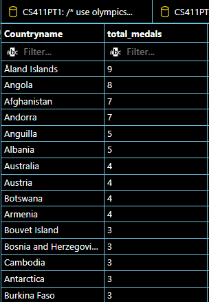

# Database Implementation

We implemented teh database locally using MySQL workbench and integrated with VisualStudioCode.

The database connection details screenshot is as follows:

# DDL Commands

## Athlete
create table Athlete(Athleteid VARCHAR(20) Primary KEY, Name VARCHAR(255), Gender ENUM('Male', 'Female'));

## Sport
create table Sport(Sportid VARCHAR(50) Primary Key, Sportname VARCHAR(50), Category VARCHAR(50));

## Country
create table Country(Countryname VARCHAR(255) Primary Key, NationalSport VARCHAR(50));

## Team
create table Team(
Teamid VARCHAR(50) Primary key,
TeamName VARCHAR(50),
Countryname VARCHAR(255),
Foreign Key (Countryname) references Country (Countryname));

## Belongs
create table Belongs(
Athleteid VARCHAR(20),
Teamid VARCHAR(50),
Foreign Key (Athleteid) references Athlete (Athleteid),
Foreign Key (Teamid) references Team (Teamid),
Primary Key (Athleteid, Teamid));

## Roles
create table Roles(
Athleteid VARCHAR(20),
Role ENUM('Player', 'Coach'),
Foreign Key (Athleteid) references Athlete (Athleteid),
Primary Key (Athleteid));

## Plays
create table Plays(
Teamid VARCHAR(20),
Sportid VARCHAR(50),
Position INT,
Foreign Key (Teamid) references Team (Teamid),
Foreign Key (Sportid) references Sport (Sportid),
Primary Key (Teamid, Sportid));

# Number of Entries in each created table
## Athlete
select count(*) as athlete_count from athlete;

## Sport
select count(*) as sport_count from sport;

## Country
select count(*) as country_count from country;

## Team
select count(*) as team_count from team;

## Belongs
select count(*) as belongs_count from belongs;

## Roles
select count(*) as roles_count from roles;

## Plays
select count(*) as plays_count from plays;

# Advanced Queries

## Query 1
List top 15 countries in olympics based on medals count

### Query:
select Countryname, count(teamid) as total_medals

from plays natural join team 

where position < 4

group BY Countryname

order by total_medals DESC

LIMIT 15;

## Query 1 Ouput 
The output is limited to 15 rows

## Query 2
For each sport find the country with gold, silver & bronze and no of countries contested

### Query
select * from

(select Sportname, count(DISTINCT(Countryname)) as No_of_Countries_Participated

FROM team natural join plays natural join sport

group BY Sportid) as Num_Partcipants

natural join

(select Sportname, Countryname as Gold_Medal_Winner

from Sport natural join Plays natural join team

where position = 1) as Gold

natural join

(select Sportname, Countryname as Silver_Medal_Winner

from Sport natural join Plays natural join team

where position = 2) as Silver

natural join

(select Sportname, Countryname as Bronze_Medal_Winner

from Sport natural join Plays natural join team

where position = 3) as Bronze

LIMIT 15;

## Query 2 Ouput
We limit the ouput to 15 entries

# Indexing

## Query 1

## Query 2
Show index screenshots default
## Sport

## Plays

## Team

## Explain Analyze before adding new indexes

The cost is 86783

## Adding new index on Sport(sportname)

## Explain Analyze after adding index on Sport(sportname)

The cost is 10963

## Adding new index on Plays(position)

## Explain Analyze after adding index on Plays(position)

The cost is 358

## Showing indexes where both Sport(sportname) and Plays(position) are used

## Explain Analyze after adding index on Sport(sportname) and Plays(position)

The cost is 116

## Explanation & Analysis

### Default indexing
In the initial stage when indexing is limited to the keys, many attributes are searched and selected based on various query conditions that are not yet indexed. This results in an overhead as the system must retrieve those necessary values without the benefit of indexing. Due to this we observed the highest cost of 86783. 

### Addind new index on Sport(sportname)
In the query we see that the selection is actually being performed on sportname attribute, so adding index to this particular attribute may reduce the cost because it reduces the overhead of retrieving sportname from sportid which is the default indexing for this table.
This is observed in the results as the cost is reduced to 10963.

### Addind new index on Plays(position)
In the query we can see that for the last three subqueries where clause is added with position attribute as this operation contributes to fair amount of cost because this is done for every tuple for all the specified subqueries.
So there is a drastic change in the cost by adding index on position attribute. The cost now is 358.

### Addind new index on Sport(sportname) and Plays(position)
Finally when both indexes sportname and position are used the total performace got commulated (As both the attributes contributed positively to the cost performance above) and hence the cost got reduced to the lowest possible value which is 116. 

# Stage-2 Improvements

## Added new attribute to Country Relation
Previously country relation has only one attribute Countryname but now we have added new attribute NationalSport.
