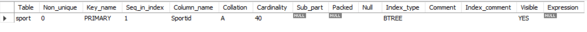

# Database Implementation

We implemented the database locally using MySQL workbench and integrated with VisualStudioCode.

The database connection details screenshot is as follows:

# DDL Commands

## Athlete
create table Athlete(Athleteid VARCHAR(20) Primary KEY, Name VARCHAR(255), Gender ENUM('Male', 'Female'));

## Sport
create table Sport(Sportid VARCHAR(50) Primary Key, Sportname VARCHAR(50), Category VARCHAR(50));

## Country
create table Country(Countryname VARCHAR(255) Primary Key, NationalSport VARCHAR(50));

## Team
create table Team(
Teamid VARCHAR(50) Primary key,
TeamName VARCHAR(50),
Countryname VARCHAR(255),
Foreign Key (Countryname) references Country (Countryname));

## Belongs
create table Belongs(
Athleteid VARCHAR(20),
Teamid VARCHAR(50),
Foreign Key (Athleteid) references Athlete (Athleteid),
Foreign Key (Teamid) references Team (Teamid),
Primary Key (Athleteid, Teamid));

## Roles
create table Roles(
Athleteid VARCHAR(20),
Role ENUM('Player', 'Coach'),
Foreign Key (Athleteid) references Athlete (Athleteid),
Primary Key (Athleteid));

## Plays
create table Plays(
Teamid VARCHAR(20),
Sportid VARCHAR(50),
Position INT,
Foreign Key (Teamid) references Team (Teamid),
Foreign Key (Sportid) references Sport (Sportid),
Primary Key (Teamid, Sportid));

# Number of Entries in each created table
## Athlete
select count(*) as athlete_count from athlete;

## Sport
select count(*) as sport_count from sport;

## Country
select count(*) as country_count from country;

## Team
select count(*) as team_count from team;

## Belongs
select count(*) as belongs_count from belongs;

## Roles
select count(*) as roles_count from roles;

## Plays
select count(*) as plays_count from plays;

# Advanced Queries

## Query 1
List the countries based on descending order of medals count and display total players and total number of medals.

This query uses join of multiple relations and aggregation via Group By.

### Query:
select countryname,total_medals, total_players

from

(select Countryname, count(teamid) as total_medals

from plays natural join team

where position < 4

group BY Countryname) as Medal_cnt

natural join

(select countryname, count(athleteid) as total_players

from Team natural join belongs natural join Roles

where role = "Player"

group by countryname) as Player_cnt

order by total_medals desc

limit 15;

## Query 1 Ouput 
The output is limited to 15 rows

## Query 2
For each sport find the winner of  gold, silver & bronze medals and number of countries contested.

This query uses join of multiple relations and aggregation via Group By.

### Query
select * from

(select Sportname, count(DISTINCT(Countryname)) as No_of_Countries_Participated

FROM team natural join plays natural join sport

group BY Sportid) as Num_Partcipants

natural join

(select Sportname, Countryname as Gold_Medal_Winner

from Sport natural join Plays natural join team

where position = 1) as Gold

natural join

(select Sportname, Countryname as Silver_Medal_Winner

from Sport natural join Plays natural join team

where position = 2) as Silver

natural join

(select Sportname, Countryname as Bronze_Medal_Winner

from Sport natural join Plays natural join team

where position = 3) as Bronze

LIMIT 15;

## Query 2 Ouput
We limit the ouput to 15 entries

# Indexing

## Query 1
Show index screenshots default

## Plays

## Team

## Belongs

## Roles

## Explain Analyze before adding new indexes

Initally, without any added indexes we see that for the Medal_cnt table(first subquery), the join is based on TeamId, for this the cost is 290, the cost for filtering results based on the position is 135.

For the Player_Cnt table(second subquery)we see that the join is based on teamid,AthleteId, the cost for this is 1928 and the cost for filtering based on role attribute is 380.

And for both the subqueries the aggregation of the results is done using the countryname attribute.

In this we see that the main attributes that are contributing to the cost are TeamId, position,countyname, role, athleteid.

In the default indexing we already have indexes for the keys and Since TeamId, AthleteId,countryname are keys in the relations used, they already are indexed, so lets try indexing the other attributes from the above mentioned list(position, role) to increase the overall performance of the query.

## Adding new index on Plays(position)

## Explain analyze after Adding new index on Plays(position)

As in the Medal_cnt temporary table(Subquery 1) we see that the filtering is based on the position attribute, so before adding index to the position attribure the cost for this filtering using the position attribute is 135, and once we added the index for the position attribute the cost reduced to 27.2, but the cost of filtering and joins didnt change for Player_cnt table when compared to the default case, this is expected because the position attribute is not being used  in the first subquery.

So inorder to increase performance of the Player_Cnt table(First Subquery),we need to index on an attribute that is being used in this part of the query and doesnt already have an index, so we index the role attribute.

## Adding new index on Roles(role)

## Explain analyze after Adding new index on Roles(role)

As in the Player_cnt temporary table(Subquery 2) we see that the filtering is based on the role attribute, so before adding index to the position attribure the cost for this filtering using the role attribute is 380, and once we added the index for the role attribute the cost reduced to 293, but the cost of filtering and joins didnt change for Medal_cnt table when compared to the default case, this is expected because the role attribute is not being used  in the first subquery.

As, after adding indexes on The position attribute and the role attribute, we indvidually observed cost reductions for Subqueries 1 and 2 respectively. So lets see if we can add indexing to both these attribues and see reduction in cost of both these subqueries.

## Showing indexes where both Roles(role) and Plays(position) are used

## Explain Analyze after adding index on Roles(role) and Plays(position)

After adding index to both position and role attributes which are individually contributing to the cost reduction of subqueries 1 and 2, indexing both these attributes resulted in the cost reduction of both the subqueries by reducing the cost of filtering in the first subquery from 135  to 27.2, reducing the cost of filtering in the second subquery from 380 to 293 when compared to the default results.

We see that the minimum cost is attained for the case where we are indexing both the role and position attributes, this is expected because both the attributes contribute to the individual cost reduction in both the subqueries.

## Query 2
Show index screenshots default
## Sport

## Plays

## Team

## Explain Analyze before adding new indexes

In this Qquery we are using 4 temporay tables(subqueries), in the first subquery we are using the TeamId, SportId for joining the tables and are grouping by using the SportId attributte, in all the next 3 subqueries, we are using SportId, TeamId to join the relations and are filetering based on position attribute, we are also selecting the sportname the attribute in the first subquery.

So we see that the Attributes that are contibuting to the cost are TeamId, SportId, Position, Sportname.

Since the Attributes TeamId, SportId, Sportname are already keys there will be default indexing based in these values:

The cost for Subquery 1(Num_Participants):
joining using TeamId, SportId: 719

The Cost for Subquery 2(Gold):
joining using TeamId, SportId: 328
Filtering using Position: 135

The Cost for Subquery 3(Silver):
joining using TeamId, SportId: 2647
Filtering using Position:1.9

The Cost for Subquery 4(Bronze):
joining using TeamId, SportId: 8538
Filtering using Position:1.85

and the cost for joining the results of all the subqueries is 86783.

Since the position attribue is contributing significantly to the cost, lets index this attribute and observe the results

## Adding new index on Plays(position)

## Explain Analyze after adding index on Plays(position)

After indexing the position attribute the cost of the Subqueries2,3 and 4 are:
The Cost for Subquery 2(Gold):

Filtering using Position:reduced to 0.826 from 135

The Cost for Subquery 3(Silver):
Filtering using Position:reduced to 0.826 from 1.9

The Cost for Subquery 4(Bronze):
 
Filtering using Position:reduced to 0.826 from 1.85

So we see that the cost reduced signifanctly because of which the total cost of joining all these tables is reduced to 358, which is a very big improvement.

We also see that we are selecting the sportname attribute, but the index is on sportid, so it takes some time to retrive the sportname from the sportid, so lets see if we can minimize the cost by indexing the sportname attribute.
## Adding new index on Sport(sportname)

## Explain Analyze after adding index on Sport(sportname)

After adding the index on the sportname attribute we see that the scan cost of the Sports table using this index is 4.25, where initially when there is no index on the sportname attribute and the selection has to be done based on the sportid index and then retrive the sportname form the sportid, the cost to scan the Sports table in the Num_Partipants is reduced to 4.25 from 5 because of this the join cost was reduced to 166 from 254, also in the Gold table the scan cost is reduced to 0.253 from 1.and the join costs for joining the team and Sport relation are reduced drastically across all the joins for all the subqueries which resulted in a result of all this the total cost of joining all the relations is reduced to 10963 from 86783.

## Showing indexes where both Sport(sportname) and Plays(position) are used

## Explain Analyze after adding index on Sport(sportname) and Plays(position)

Since both the sportname and the postion attributed when indexed indivdually are contributing to the reduction of costs, we tried indexing both of these attributed together and the costs are reduced as follows:
 The Cost for Subquery 2(Gold):

Filtering using Position:reduced to 0.826 from 135

The Cost for Subquery 3(Silver):
Filtering using Position:reduced to 0.828 from 1.9

 
Filtering using Position:reduced to 0.835 from 1.85

And the join costs for joining the team and Sport relation are reduced drastically across all the joins for all the subqueries which resulted in reducing the cost drastically from 86783 to 116.

# Stage-2 Improvements

## Added new attribute to Country Relation
Previously country relation has only one attribute Countryname but now we have added new attribute NationalSport.

## Added new relationships to User relation
Previously User is not participating in any relationships but now we have added two new relationships LikeSport & LikeCountry which adds a feature of User liking specific countries and sports.
