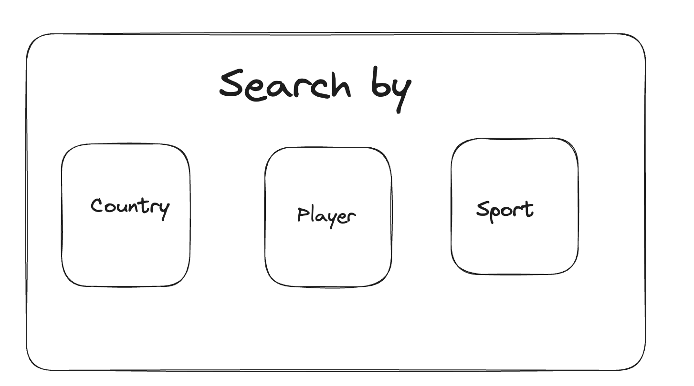
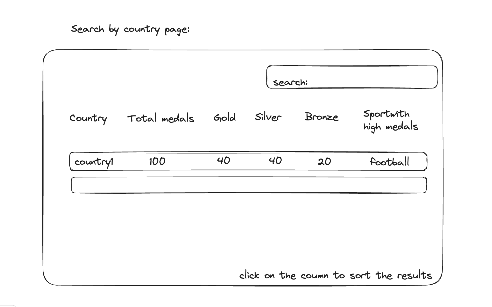

## Title of the Project is Champion Voyage: Navigating Medal Triumphs

## Project Summary
Inspired by the rich history, achievements and the triumphs stored in the form of Olympic data, the project captures the essence of the global sports spectacle and offers a detailed view of medal achievements across diverse sporting disciplines. Champion Voyage: Navigating Medal Triumphs is a web application that allows its users to explore achievements of different players, countries across the globe in different sports. This Project Stands out due to its extensive detailing provided at different levels. Designed with a user-centric approach, ChampionVoyage ensures easy access to information and effortless exploration of historical and contemporary sports achievements. Extensive research has confirmed the project's uniqueness, as there are no identical applications that provide such a comprehensive and fine-grained exploration of sports medals and the individuals behind them. The existing Olympics website offers the results which we show but in a de-centralized way, we are creating an application which gives out only the required content in a centralized way which would be easy for users who want to focus on the analytical data of medals. Also our application soleley focuses on providing just the details mentioned above but in the Olympics Website it has other information non-relevant to a user who wants to focus only on medals.

This idea is inspired by looking at the data from one of the recommended Datasets by the Teaching staff(https://docs.google.com/document/d/1Lz44h4D1w8KI7q5wNQcJ_Fvd7r7VokoFtDvMkiEkX7U/edit?usp=sharing). This Dataset contains details of Athletes(name, country and the sport), Coaches (name, country, sport, category), Entries_Gender (Sport, Number of males, number of females), Medals (Country, Gold, Silver, Bronze) and additional tables such as user(name, userid, password, category) will be added. The Data set will be changed accordingly to accommodate all the features of this project. This dataset also contains the number of males and females participating in each sport and the number of medals won by each country in each sport. The Data is form kaggle(https://www.kaggle.com/datasets/arjunprasadsarkhel/2021-olympics-in-tokyo).

The functions of our web application include but not limited to storing the data of users and the admins and providing the edit access to the admins to add or alter any new entries inorder to corporate the idea of dynamic data in the project. Search the number of medals for each country or each sport or each player. They can also combine these features to get the relevant details the users are looking for. For example: a user can first start by searching on a specific country and then dive into each sport and can further continue the navigation to know which player and coaches contribuited to the triumph. The level of search given to the users makes our project functionality unique.

## Creative component
One of the really useful components that can be added to this project can be some functionalities such as visulaising the stastical data with intersiting graphs and the option to compare the performances and various other factors among countries, Players, Sports and Coaches, we think this will be a very good addition to the current workflow because it adds more detais and will be easy to analyse and compare the components that the user is intrested in. Also this makes the unser interface more aesthetic and makes it more interactive.

## Description
Champion Voyage is like a treasure map for sports lovers. It's a special database project inspired by the exciting world of the Olympics. Imagine it as a big book that tells you which countries win medals in different sports, like running, swimming, and gymnastics. But it's not just about numbers; it's also about the amazing people behind these medals. This project solves the problem of understanding minute details of which sport contributed more to the medals of a country or the persons behind those triumphs and provides easy access to the data that can be used for many analytical, knowledge and exploration based purposes. 

When you visit Champion Voyage, you can explore which countries are the best at sports, and you can even meet the athletes, coaches, and other helpers who made these victories happen. It's like a journey into the heart of sports history, and it's designed to be super easy to use. Whether you're a big sports fan, a curious explorer, or a history buff, Champion Voyage is here to help you discover the stories of champions from all around the world. Plus, it's one of a kind – there's nothing else like it out there. This project can grow even bigger and better in the future, so there's always something new to explore.
 

## Usefulness
Champion Voyage is a highly useful application for sports enthusiasts, historians, and researchers. It offers a comprehensive database of global sports achievements, allowing users to easily discover which countries have won medals in various sports events. What sets it apart is its in-depth profiles of the athletes, coaches who contributed to these victories. While there are many higher level statstics of olympic data on the internet there is  no application that not only just provides medal counts but also delving into the details of humans behind the medals, offering a richer and more engaging perspective on sporting success. This makes our Project unique. Inspired by the Olympics, it provides a unique opportunity to explore the excitement of international sports achievements. With its user-friendly design and unparalleled depth of information, Champion Voyage is a valuable resource that sets a new standard in the world of sports databases.

## Realness
The data is taken from recommended datasets given by the teaching staff. This is an Olympic dataset which covers all the details of Players, coaches and the number of medals won by each country participated and in each sport and is from Kaggle.

## Functionality
This projects operates on the Olympic data, when a user visits our webpage it allows them to login  as user or admin according to their privileges, when an admin is trying to login it also checks some of the constraints that an Admin should satisy(such as e-mail domaim, and the OTP sent to the email domain). Once logged in sucessfully the admin can make changes to the data. When it comes to the user, the login is not mandatory however if logged in the application provides extra features of saving favourites thus providing better experience. New users can register to create new accounts and this data will be dynamically stored into the database. 

Once the user enters the application there will be many options to search on (Eg: Countries, Sports, Players), once the user picks one of the filters the data corresponding to that filter will be provided and the user can sort it based on their requirements and preferences. Once the data is diplayed on the webpage they can further click on the selected categories to make the information more detailed.

For example, if a user chooses to list the data out based on the countries, they can click on the countries icon on the webpage and that leads to a new page which lists out the number of medals won by each country, the user now can further navigate to see the details of the medals by clicking on the specific county. In this page there will be a search bar to pick a country easily. Once the user clicks on the countries they will be redirected to another webpage which lists out the number of medals won by that particular country in all the sporting events that it participated on and also provides sort and search options and this goes further until it displays details of the player and also the coach.

Point to be noted: Only admins can make changes to the database entries of athletes, countries, sports and coaches but users cannot have that access, they are limited only to search and explore the database through the UI of the webpage.

## Low-Fidelity UI Mockup
1)By entering the website the user will be asked to login, the webpage looks like below:

The people can login either as user or admin based on their privileges or can signup as a new user or skip the login

2)Upon logging in the users will be redirected to a home search page where they can search based on different categories:

3)The user can click on one of the options and will be redirected to the next page, for example if the user click on country option they will be redirected to the following page where they can sort the records or search for a record

The users can click on particular country or the medals to have a detailed view, and the design will be similar for the other search filters as well.

## Project Work Distribution

Venkata Sai Ashrith Kona(kona2) : Design & Implementation of Front end, Quality assurance.

Taraka Vignesh Mullapudi(tvm3) : Designing and populating the Database.

Sai Venkata Abhijith Geda(geda2): Maintenance of the DB and integration with the front end.

Sandeep Naidu Mudili(smudili2) : Designing Queries and Testing of the Application.

