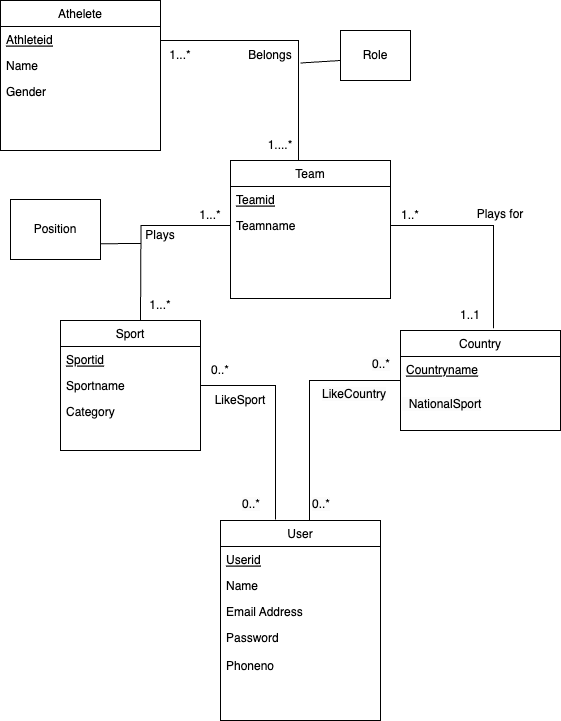

# The UML for our schema is: 

# Description of Relationships in UML
There are three relationships Belongs, Plays and PlaysFor
1) Belongs is a many to many relationship between Athlete and Team and it indicates an Athlete can belong to one or more teams and similarly a Team can have one or more Athletes. An athlete can belong to a team either as a Coach or a Player this is determined by the Role relationship attribute which is specific to this relationship.

2) Plays is a many to many relationship between Team and Sport and it indicates a Team can play one or more Sports and similarly a Sport can be played by One or more Teams. The position won for a Team in a given Sport can be determined by the Relationship attribute Position.

3) PlaysFor is a many to one relationship between Team and Country and it indiactes a Team can play for only one country and a Country can have multiple Teams.

4) LikeSport is a many to many relationship between User and Sport which indicates a User can Like any number of sports which will help in personalizing the experience and a Sport can be liked by any number of users.

5) LikeCountry is a many to many relationship between User and Country which indicates a User can Like any number of countries which will help in personalizing the experience and a Country can be liked by any number of users.

# Converting UML to relational schema yields the following:

1) User(Userid: VARCHAR(20) [PK], Name: VARCHAR(255), EmailAddress: VARCHAR(255), Password: VARCHAR(255), Phoneno: VARCHAR(15))

In the above Relation, the FDs are as follows:
Userid-> Name, EmailAddress, Password, Phoneno
EmailAddress-> Name, Userid, Password, Phoneno
Phoneno-> Name, EmailAddress, Password, Userid
The candidate keys are Userid, EmailAddress and Phoneno. Hence for all the FDs the 
L.H.S is a superkey and thus User relation is in BCNF.
So, It Satisfies both 3NF & BCNF.
No need of normalisation it already exists in BCNF & 3NF.

2) Athlete(Athleteid: VARCHAR(20) [PK], Name: VARCHAR(255), Gender: ENUM)

The FDs are as follows:
Athleteid->Name, Gender
The candidate key is only Athleteid. Hence for all the FDs the L.H.S is a superkey and thus Athlete relation is in BCNF.
So, It Satisfies both 3NF & BCNF.
No need of normalisation it already exists in BCNF & 3NF.

3) Sport(Sportid: VARCHAR(50) [PK], Sportname: VARCHAR(50), Category: VARCHAR(50))

The FDs are as follows:
Sportid->Sportname, Category
The candidate key is only Sportid. Hence for all the FDs the L.H.S is a superkey and thus Sport relation is in BCNF.
So, It Satisfies both 3NF & BCNF.
No need of normalisation it already exists in BCNF & 3NF.

4) Country (Countryname: VARCHAR(20) [PK], NationalSport: VARCHAR(50))
The FDs are as follows:
Countryname->NationalSport
The candidate key is only Countryname. Hence for all the FDs the L.H.S is a superkey and thus Country relation is in BCNF.
So, It Satisfies both 3NF & BCNF.
No need of normalisation it already exists in BCNF & 3NF.

5) Team(Teamid: VARCHAR(50) [PK], TeamName: VARCHAR(50), Countryname: VARCHAR(20) [FK to Country.Countryname])
The attribure Countryname is added to the Team relation as foreign key referencing Countryname attribute in Country Relation, because Team and Country are part of a Many to One Relationship named "Playsfor", and hence Team can Play for only one country.

The FDs are as follows:
Teamid->TeamName, Countryname
The candidate key is only teamid. Hence for all the FDs the L.H.S is a superkey and thus Team relation is in BCNF.
So, It Satisfies both 3NF & BCNF.
No need of normalisation it already exists in BCNF & 3NF.

6) Belongs(Athleteid: VARCHAR(20) [PK] [FK to Athlete.Athleteid], Teamid: VARCHAR(50) [PK] [FK to Team.Teamid], Role: ENUM)
Belongs is a Many to Many relationship consisting of Athlete and Team, this means an athlete can be part of multiple teams and a team can have multiple athletes. One important point to note is that Role attribute is a relational attribute for Belongs.
It can have two values either player or a coach, which means an athlete can belong to a team as either a player or a coach.
Athleteid and Teamid are foreign keys referencing Athlete and Team tables respectively.
The primary key is composite consisting both Athleteid and Teamid.

The FDs are as follows:
Athleteid->Role
Candidate key is (Athleteid,Teamid)

For the above FD Athleteid is not a superkey hence this violates BCNF
We also see that the RHS which is Role is not part of candidate key hence this violates 3NF.
So to convert this into BCNF
We find the closure of Athleteid which in this case is only Athleteid and Role

So we split the relation into following:
Belongs(Athleteid: VARCHAR(20) [PK] [FK to Athlete.Athleteid], Teamid: VARCHAR(50) [PK] [FK to Team.Teamid]) 
and 
Roles(Athleteid: VARCHAR(20) [PK] [FK to Athlete.Athleteid], Role:ENUM)

Now after Normalisation the new relations are as follows:

a) Belongs(Athleteid: VARCHAR(20) [PK] [FK to Athlete.Athleteid], Teamid: VARCHAR(50) [PK] [FK to Team.Teamid])
For this there are no FDs so this relation is in BCNF and hence satisfies both 3NF & BCNF.

b) Roles(Athleteid: VARCHAR(20) [PK] [FK to Athlete.Athleteid], Role:ENUM)
The FDs are:
Athleteid->Role
The candidate key is Athleteid and for the given FD Athleteid is a superkey so this relation is in BCNF and hence satisfies both BCNF & 3NF.

In the above scenario, we have only one FD which can be preserved even after splitting into BCNF, hence we are not losing any FDs while splitting into BCNF and also even if we choose 3NF we will get the same relations as BCNF. So, since splitting into BCNF is not leading to any loss of FDs and splitting into 3NF is not leading to added redundancies we can choose either of that as there is no difference. We go ahead and chosen the higher form which is BCNF.

7) Plays(Teamid: VARCHAR(50) [PK] [FK to Team.Teamid], Sportid: VARCHAR(50) [PK] [FK to Sport.Sportid], Position: INT)
Plays is a Many to Many relationship consisting of Sport and Team, this means a team can be part of multiple sports and a sport can have multiple teams. One important point to note is that Position attribute is a relational attribute for Plays. The attributes
Sportid and Teamid are foreign keys referencing Sport and Team tables respectively.
The primary key is composite consisting both Sportid and Teamid.

The FDs are as follows:
Teamid, Sportid -> Position
The candidate key is (Sportid,Teamid) and for the given FD the L.H.S is a superkey so this relation is in BCNF. So, It Satisfies both 3NF & BCNF.
No need of normalisation it already exists in BCNF & 3NF.

8) LikeSport(Userid: VARCHAR(20) [PK] [FK to User.Userid], Sportid: VARCHAR(50) [PK] [FK to Sport.Sportid])
There are no FDs so the relation is already in both BCNF & 3NF

9) LikeCountry(Userid: VARCHAR(20) [PK] [FK to User.Userid], Countryname: VARCHAR(20) [PK] [FK to Country.Countryname])
There are no FDs so the relation is already in both BCNF & 3NF

# Final relational schema:

1) User(Userid: VARCHAR(20) [PK], Name: VARCHAR(255), EmailAddress: VARCHAR(255), Password: VARCHAR(255), Phoneno: VARCHAR(15))

2) Athlete(Athleteid: VARCHAR(20) [PK], Name: VARCHAR(255), Gender: ENUM)

3) Sport(Sportid: VARCHAR(50) [PK], Sportname: VARCHAR(50), Category: VARCHAR(50))

4) Country(Countryname: VARCHAR(20) [PK], NationalSport: VARCHAR(50))

5) Team(Teamid: VARCHAR(50) [PK], TeamName: VARCHAR(50), Countryname: VARCHAR(20) [FK to Country.Countryname])

6) Belongs(Athleteid: VARCHAR(20) [PK] [FK to Athlete.Athleteid], Teamid: VARCHAR(50) [PK] [FK to Team.Teamid])

7) Roles(Athleteid: VARCHAR(20) [PK] [FK to Athlete.Athleteid], Role: ENUM)

8) Plays(Teamid: VARCHAR(50) [PK] [FK to Team.Teamid], Sportid: VARCHAR(50) [PK] [FK to Sport.Sportid], Position: INT)

9) LikeSport(Userid: VARCHAR(20) [PK] [FK to User.Userid], Sportid: VARCHAR(50) [PK] [FK to Sport.Sportid])

10) LikeCountry(Userid: VARCHAR(20) [PK] [FK to User.Userid], Countryname: VARCHAR(20) [PK] [FK to Country.Countryname])

# Assumptions to be known of:

# Athlete:
a) Each Athlete is identified by a unique Athleteid and has name and gender

b) Athlete can belong to a team either as a Coach/Player which is determined by the Role relationship attribute for "Belongs" Relationship

c) Athlete can participate in a sport only via a team, so Athlete has to be part of atleast one team

# Team:
a) A Team must have atleast one athlete and must participate in atleast one Sport

b) Each Team has Teamid which is unique and a Teamname

c) A Team wins a gold, silver and bronze for positions 1, 2 and 3 respectively. Position is a relationship attribute for "Plays" relationship

d) If a team wins a medal all the players in that team also get a medal

# Sport:
a) A Sport Relation contains the details of the sports in the form of SportName and its Category (Eg: SportName: 3x3 Basketball, Category: Basketball)

b) A Sport must be played by atleast one team

# Country:
a) Country relation contains only the countries that are part of Olympics

b) Each country has a unique Countryname

c) Each country has an attribute named NationalSport indicating what is the national sport for that country.

# User:
a) A user should have unique email, userid and phoneno and thus are mandatory

b) Each user has attributes email, userid, phoneno which are unique and also a name and password

c) A user can like sports and countries which they frequently visit according to their choice
